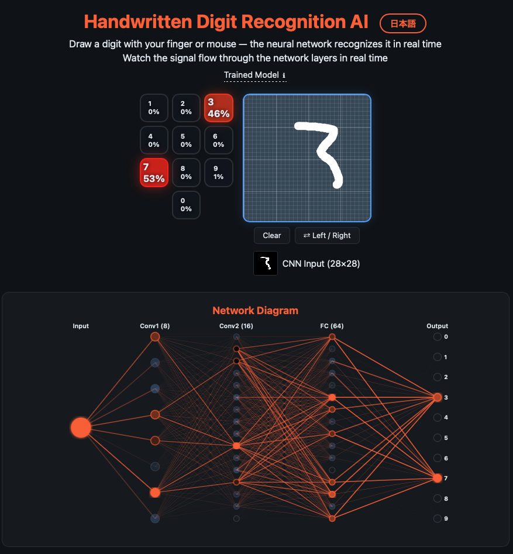

> 🇯🇵 [日本語版はこちら](README_ja.md)

# Handwritten Digit Recognition AI

**[Try the Demo](https://tomoiura.github.io/digit_recognizer/)**



Draw a digit with your finger or mouse — the neural network recognizes it in real time.
Watch the signal flow through the network layers in real time.

## Features

- **Real-time inference** — the CNN runs inference on every stroke as you draw
- **Dial-style heatmap** — confidence for digits 0–9 shown as color intensity, updating in real time
- **Network diagram** — Input → Conv1 → Conv2 → FC → Output nodes and links light up based on signal strength
- **CNN input preview** — see how your drawing is downscaled to 28×28 pixels
- **Left/right swap** — supports both left-handed and right-handed users

## Model

A real neural network with 27,690 parameters (1/65-millionth of GPT-4), yet achieves 98% accuracy — showing the efficiency of CNNs.

- **Training data**: MNIST 60,000 images
- **Test accuracy**: 98.04% (on 10,000 unseen images)
- **Architecture**: Conv(5x5,8ch) → Pool → Conv(3x3,16ch) → Pool → FC(64) → FC(10)

## Tech Stack

| Component | Technology |
|---|---|
| Training | Python / pure NumPy (no PyTorch) |
| Inference | Vanilla JavaScript (runs in browser) |
| Visualization | SVG + Canvas + CSS |
| Output | Single HTML file (no dependencies, ~620KB) |

## Usage

### Open the pre-built HTML

Simply open `output/index.html` in your browser.

### Rebuild from source

```bash
pip install numpy
python main.py
```

The first run downloads MNIST data and trains the model (takes a few minutes).
Subsequent runs use cached weights and complete in seconds.

The generated HTML is saved to `output/index.html`.

## File Structure

```
digit_recognizer/
├── main.py              # Entry point (train → generate HTML)
├── model.py             # CNN (forward + backward) pure NumPy
├── trainer.py           # SGD mini-batch training
├── data.py              # MNIST download and loading
├── visualizer_html.py   # HTML/CSS/JS generator
└── output/
    └── index.html       # Generated single-file HTML app
```

## Feedback

If you find technical errors or have suggestions for improvement, Issues and Pull Requests are welcome.

## Author

Tomohisa Iura ([@Tomoiura](https://github.com/Tomoiura)) — tomo@kanadeki.jp

## License

MIT License - see [LICENSE](LICENSE) for details.
