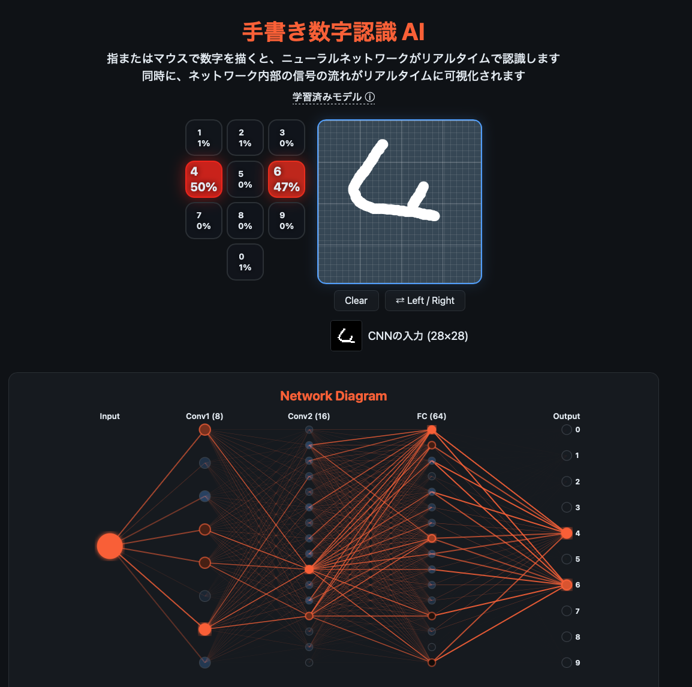

> 🇬🇧 [English version](README.md)

# 手書き数字認識 AI

**[デモを試す](https://tomoiura.github.io/digit_recognizer/)**



指またはマウスで数字を描くと、ニューラルネットワークがリアルタイムで認識します。
同時に、ネットワーク内部の信号の流れがリアルタイムに可視化されます。

## 特徴

- **リアルタイム推論** — 描画中にストロークごとにCNNが推論を実行
- **ダイヤル型ヒートマップ** — 0〜9の確信度が色の濃さでリアルタイムに変化
- **ネットワーク図** — Input → Conv1 → Conv2 → FC → Output のノードとリンクが信号の強さに応じて光る
- **CNNの入力プレビュー** — 描いた文字が28×28にどう縮小されるか確認できる
- **左右入替** — 左利き/右利きに対応

## モデル

小さいながらも27,690パラメータ（GPT-4の6,500万分の1）を持つ本物のニューラルネットワークです。
それでも98%の精度が出せるのでCNNの効率の良さがわかります。

- **学習データ**: MNIST 60,000枚
- **テスト精度**: 98.04%（未知の10,000枚に対して）
- **モデル構成**: Conv(5x5,8ch) → Pool → Conv(3x3,16ch) → Pool → FC(64) → FC(10)

## 技術構成

| 要素 | 技術 |
|---|---|
| 学習 | Python / 純NumPy（PyTorch不使用） |
| 推論 | Vanilla JavaScript（ブラウザ内で実行） |
| 可視化 | SVG + Canvas + CSS |
| 出力 | 単一HTMLファイル（外部依存なし、約620KB） |

## 使い方

### 生成済みHTMLを開く

`output/index.html` をブラウザで開くだけで動きます。

### ソースから再生成する場合

```bash
pip install numpy
python main.py
```

初回はMNISTデータのダウンロード + 学習（数分）が実行されます。
2回目以降はキャッシュされた重みを使うため数秒で完了します。

生成されたHTMLは `output/index.html` に出力されます。

## ファイル構成

```
digit_recognizer/
├── main.py              # エントリポイント（学習→HTML生成）
├── model.py             # CNN（forward + backward）純NumPy実装
├── trainer.py           # SGDミニバッチ学習
├── data.py              # MNISTダウンロード・読み込み
├── visualizer_html.py   # HTML/CSS/JS生成
└── output/
    └── index.html       # 生成された単一HTMLアプリ
```

## フィードバック

技術的な誤りや説明の改善点があれば、Issue や Pull Request を歓迎します。

## 作者

Tomohisa Iura ([@Tomoiura](https://github.com/Tomoiura)) — tomo@kanadeki.jp

## ライセンス

MIT License - 詳細は [LICENSE](LICENSE) を参照してください。
